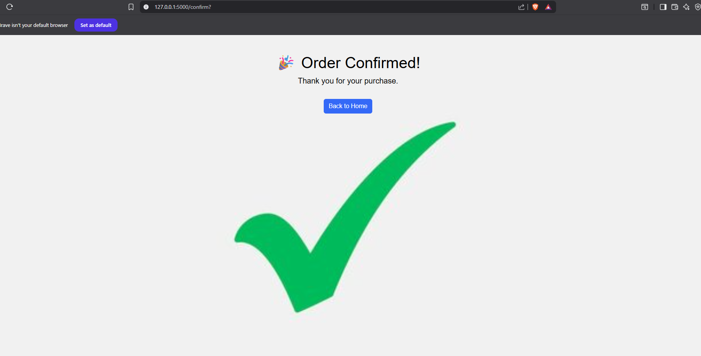

# Flask E-Commerce Web App

A simple e-commerce website built with Flask that allows users to browse products, add them to a cart, proceed to checkout, and simulate a payment process using a fake payment popup (no real transactions).

## Features
- **Home Page** – Displays available products from an API.
- **Cart Page** – Shows items added to the cart with quantity and total.
- **Checkout Page** – Displays the total amount and opens a fake payment popup.
- **Payment Simulation** – Looks like a real payment gateway but no actual payment is processed.
- **Order Confirmation Page** – Displays a thank-you message after “payment”.

## Project Structure
project/
│
├── app.py # Main Flask application
├── templates/ # HTML templates
│ ├── home.html
│ ├── cart.html
│ ├── view_cart.html
│ ├── checkout.html
│ └── confirm.html
├── static/ # Static files (CSS, JS, images)
└── README.md


## How It Works
1. **Add Products to Cart**  
   Products are fetched from `fakestoreapi.com` and can be added to the shopping cart.

2. **View Cart**  
   Displays product details, quantity, and total price.

3. **Checkout**  
   Shows total price and a "Pay Now" button that triggers a fake payment popup.

4. **Payment Simulation**  
   The popup simulates payment processing for a few seconds before redirecting to a confirmation page.

5. **Confirmation**  
   A thank-you message is displayed after the fake payment is "processed".

## Installation

### 1. Clone the repository
```bash
git clone https://github.com/yourusername/your-repo.git
cd your-repo

## Installation

### 1. Clone the repository
```bash
git clone https://github.com/yourusername/your-repo.git
cd your-repo

2. Create a virtual environment
python -m venv venv

3. Activate the virtual environment

Windows
venv\Scripts\activate

macOS/Linux
source venv/bin/activate

4. Install dependencies
pip install -r requirements.txt

5. Run the application
python app.py

6. Open in browser
Visit: http://127.0.0.1:5000

Dependencies
Flask
Requests

You can install them manually:
pip install flask requests

7. Screenshots


### Home Page


### Cart Page


### Checkout Page


### Confirmation Page


